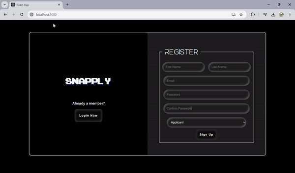

# SnApply - Apply in a Snap

**SnApply** is an innovative tool that uses voice-assisted data entry to streamline the process of applying for jobs. It simplifies job applications by allowing users to apply for positions without having to manually fill out forms across multiple portals. The tool also verifies job experience directly with companies, tracks applications, and rates companies based on their response times.

## Features

- **Voice-Assisted Data Entry**: Submit applications using your voice, reducing the need for manual form completion.
- **Job Experience Verification**: Automatically verify your past job experiences directly with previous employers.
- **Centralized Application Tracking**: Track all your job applications in one place, avoiding the need for multiple accounts across different job portals.
- **Application Process Rating**: Rate companies' application processes based on their response times and receive feedback on their efficiency.
- **Application Insights**: Gain insights into which companies respond the fastest and where to focus your efforts.
  
## Key Benefits

- **Time Efficiency**: No need to create multiple accounts or fill in redundant information. One voice command to enter data.
- **Automated Verification**: Reduce the burden of verifying past job experiences with automated checks from previous employers.
- **Comprehensive Application Management**: Track and manage all job applications from a single dashboard, without logging in to different job sites.
- **Company Feedback**: Based on response times and company engagement, SnApply helps you understand which companies provide faster feedback.

## Project Status

This project is currently **under development**. While the initial framework and features are in place, we are still working on the following key areas:
1. **Voice Assistance**: Implementing natural language processing (NLP) to handle voice commands for data entry.
2. **Experience Verification API**: Building a system that connects with employers to verify job experiences.
3. **Application Rating System**: Creating a user-driven rating mechanism to evaluate the speed and efficiency of companies’ application processes.
4. **Job Tracking Dashboard**: Integrating a centralized dashboard for users to track all their applications in one place.

## Prerequisites

Before using SnApply, ensure that you have the following:

- **Node.js** (v14.x or higher)
- **NPM** (v6.x or higher)
- **Voice API or Speech Recognition Service** (such as Google Cloud Speech-to-Text or Web Speech API)
- **Database** for storing and tracking job applications and their statuses (e.g., MongoDB, PostgreSQL)
- **API Access** for verification of job experience (third-party or company-specific)

## Installation

1. **Clone the repository**:

   ```bash
   git clone https://github.com/yourusername/SnApply.git
   ```

2. **Navigate to the project directory**:

   ```bash
   cd SnApply
   ```

3. **Install the dependencies**:

   ```bash
   npm install
   ```

4. **Configure environment variables**:

   You'll need to set up environment variables for services such as speech recognition, API keys for job verification, and database configuration. These should be added to a `.env` file.

   ```bash
   VOICE_API_KEY=your-voice-api-key
   DB_CONNECTION_STRING=your-database-connection-string
   ```

## Usage

1. **Configure User Profile**:

   In the `config` folder, modify the `userProfile.js` file with your personal details, such as name, email, and set of questions. These details will be used to automatically fill job applications.

   ```js
   module.exports = {
     name: "John Doe",
     email: "johndoe@example.com",
     questions:[]
   };
   ```

2. **Voice-Assisted Job Application**:

   To apply to a job using voice commands, use:

   ```bash
   npm run voiceApply
   ```

   The system will prompt you to provide application details using voice, filling out the application form for you.

3. **Track Applications**:

   Use the following command to view all tracked applications and their statuses:

   ```bash
   npm run trackApplications
   ```

   This will display a list of all job applications, their current status, and response times from each company.

4. **Rate Application Processes**:

   After submitting applications, you can rate the experience based on how long it took to get a response from the company. This feedback helps others evaluate the application process efficiency of different companies.

   ```bash
   npm run rateCompanies
   ```

## Future Enhancements

- **Real-time Voice Command Interpretation**: Implement real-time voice recognition to make the process even more interactive.
- **Company Integration**: Work with companies to streamline the job verification process via API integration.
- **Advanced Analytics**: Provide users with data insights on company response rates, overall application success rates, and recommendations based on job trends.
- **Notification System**: Alert users about the status of their applications and upcoming deadlines.
- **Multi-language Support**: Extend voice-assist functionality to support multiple languages.


## Contributing

We welcome contributions! If you would like to contribute to this project, follow these steps:

1. Fork the repository.
2. Create a new branch (`git checkout -b feature-branch`).
3. Make your changes and commit them (`git commit -am 'Add new feature'`).
4. Push to the branch (`git push origin feature-branch`).
5. Open a Pull Request, and we'll review your changes!

## What we have done So far

1. Speech to Text and Text to speech commands (but facing difficulties fine tuning the answers)
2. User Profile data filling, Recruiter Profile, Job Postings (Couldn't integrate jobpostings to user profile yet)
3. 
4. [DemoDriveLink](https://drive.google.com/file/d/1sC1fgm1REx4BVBn8ilPUv0p7XvsFlyDb/view?usp=sharing)
